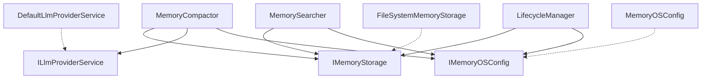

# Розділ 2: Архітектурний шаблон та DIP

Ядро Memory OS розроблено з акцентом на **модульність, портативність та слабке зв'язування**. Для досягнення цієї мети у системі застосовано принцип **інверсії залежностей (Dependency Inversion Principle — DIP)**. 

Усі ключові класи ядра залежать від абстракцій (інтерфейсів), а не від конкретних реалізацій, що дозволяє легко замінювати хмарні сервіси, бази даних або сховища.

---

## 1. Концепція Dependency Inversion

Всі абстрактні класи та контракти винесені в єдиний файл: [interfaces.py](file:///Users/oleksii/Documents/memory_os/src/memory_os/core/interfaces.py). 



Завдяки такій структурі ядро Memory OS є повністю автономним. Наприклад, ви можете перенести цю бібліотеку в проєкт Django або FastApi і замінити файлове сховище `FileSystemMemoryStorage` на реалізацію бази даних `PostgresStorage` або хмару `S3Storage` без жодних змін у логіці компактору або валідатора.

---

## 2. Ключові інтерфейси

### [IMemoryOSConfig](file:///Users/oleksii/Documents/memory_os/src/memory_os/core/interfaces.py#L6)
Окреслює конфігураційні властивості ядра. Дозволяє зчитувати налаштування з JSON-файлів, змінних оточення чи віддаленого конфіг-сервера.
* Ключові властивості: `memory_dir`, `capsules_file`, `snapshot_file`, `db_path`, `workflows`, `resource_mode`.
* Стандартна реалізація: [MemoryOSConfig](file:///Users/oleksii/Documents/memory_os/src/memory_os/core/config.py#L8) (зчитує `memory_os.config.json` або застосовує дефолтний профіль `developer`).

### [IMemoryStorage](file:///Users/oleksii/Documents/memory_os/src/memory_os/core/interfaces.py#L23)
Абстрагує операції читання/запису.
* Ключові методи: `load_jsonl`, `save_jsonl`, `append_jsonl`, `load_json`, `save_json`, `exists`, `get_sha256`.
* Стандартна реалізація: [FileSystemMemoryStorage](file:///Users/oleksii/Documents/memory_os/src/memory_os/core/storage.py#L7) (використовує вбудовані функції роботи з файлами Python).

### [ILlmProviderService](file:///Users/oleksii/Documents/memory_os/src/memory_os/core/interfaces.py#L42)
Абстрагує виклики до мовних моделей. Захищає ядро від прив'язки до SDK конкретного провайдера (наприклад, `google-generativeai` чи `openai`).
* Ключовий метод: `call_llm(user_message, system_prompt, provider, model)`.
* Стандартна реалізація: [DefaultLlmProviderService](file:///Users/oleksii/Documents/memory_os/src/memory_os/core/llm_service.py#L69).

---

## 3. Ліниве розширення та резолюція провайдерів LLM

Клас [DefaultLlmProviderService](file:///Users/oleksii/Documents/memory_os/src/memory_os/core/llm_service.py#L69) реалізує каскадний алгоритм вибору провайдера LLM (LLM Resolution Cascade). Це дозволяє використовувати хост-адаптери або автоматично перемикатися на прямі запити.

### Алгоритм роботи:
1. **Спроба завантаження хост-клієнта**:
   Спочатку сервіс намагається імпортувати фабрику клієнтів із головного проєкту (наприклад, `news-scraper` чи іншої системи-контейнера):
   `from app.services.llm_clients import LLMClientFactory`
   Якщо імпорт успішний, Memory OS передає виклик LLM хост-адаптеру. Це гарантує використання загального ліміту токенів, логування та єдиних налаштувань проєкту.
2. **Перехід на прямі HTTP-запити (URLLib)**:
   Якщо фабрику не знайдено, сервіс переходить на прямі запити, аналізуючи змінні оточення (завантажені з файлу `.env` або системних):
   * `GEMINI_API_KEY` -> Робиться запит до Google Gemini API за допомогою вбудованого модуля `urllib.request`.
   * `OPENROUTER_API_KEY` -> Робиться сумісний запит до OpenRouter API.
   * `OPENAI_API_KEY` -> Запит до OpenAI API.
   
```python
# Приклад прямого stdlib запиту до Gemini API без використання SDK
import urllib.request
import json

url = f"https://generativelanguage.googleapis.com/v1beta/models/{resolved_model}:generateContent?key={api_key}"
payload = {
    "contents": [{"role": "user", "parts": [{"text": f"{system_prompt}\n\n{user_message}"}]}]
}
data = json.dumps(payload).encode("utf-8")
req = urllib.request.Request(url, data=data, headers={"Content-Type": "application/json"})
with urllib.request.urlopen(req, timeout=60) as resp:
    result = json.loads(resp.read())
    return result["candidates"][0]["content"]["parts"][0]["text"]
```

---

## 4. Потокобезпека та підключення до БД

Для логування телеметрії та швидкодії алгоритмів Memory OS використовує вбудовану базу даних SQLite. Оскільки AI-агенти можуть працювати в асинхронних потоках, підключення реалізовано за допомогою thread-safe паттерну в класі [MemoryOS](file:///Users/oleksii/Documents/memory_os/src/memory_os/core/core.py#L8):
* З'єднання відкривається локально всередині кожного методу через [get_connection()](file:///Users/oleksii/Documents/memory_os/src/memory_os/core/core.py#L25) та гарантовано закривається в блоці `finally`.
* Застосовано `PRAGMA foreign_keys = ON` для контролю зв'язків.
* База даних ініціалізується автоматично при першому старті через метод [init_db()](file:///Users/oleksii/Documents/memory_os/src/memory_os/core/core.py#L32), що виключає необхідність попереднього запуску міграцій розробником.
