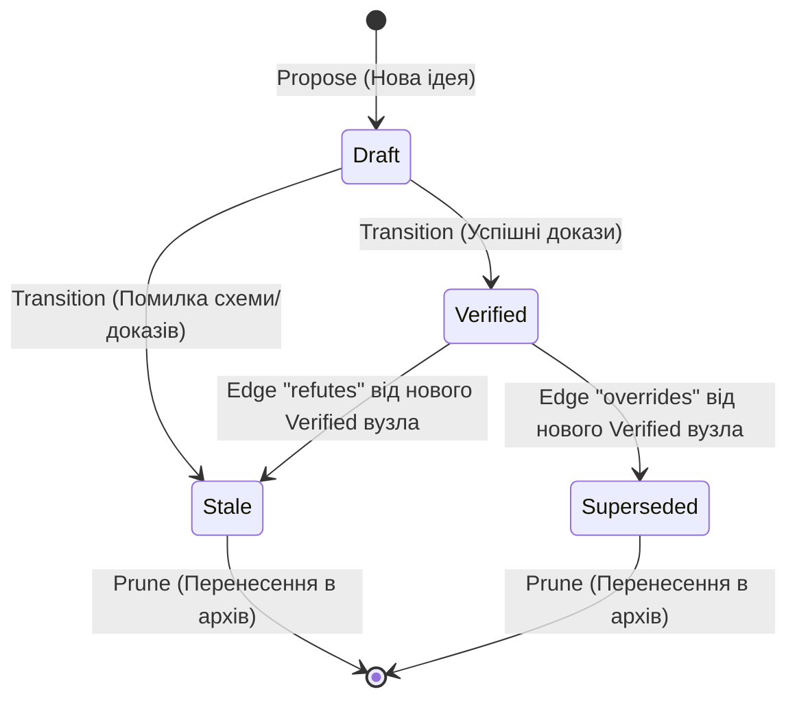

# Розділ 4: Скінченний автомат життєвого циклу знань

Граф знань Memory OS є динамічним. Щоб запобігти накопиченню помилок та застарілих правил, у системі реалізовано скінченний автомат керування станами пам'яті через клас [LifecycleManager](file:///Users/oleksii/Documents/memory_os/src/memory_os/modules/lifecycle.py#L14).

---

## 1. Карта станів вузла знань

Кожен вузол знань у `nodes.jsonl` може перебувати в одному з 5 станів:

1. **Draft (Чернетка)**: Тільки-но згенероване LLM-компактором або запропоноване розробником правило. Рівень довіри (`trust`) — `unverified`.
2. **Observed (Спостережуване)**: Факт, що має часткові докази, але потребує додаткових перевірок.
3. **Verified (Перевірене)**: Повноцінне правило або політика. Всі докази (файли) підтверджені на диску. Рівень довіри — `verified`.
4. **Stale (Застаріле/Некоректне)**: Правило, що не пройшло валідацію доказів або було спростоване іншим правилом за допомогою ребра зв'язку `refutes`.
5. **Superseded (Витіснене)**: Правило, яке було повністю замінене більш актуальним за допомогою ребра зв'язку `overrides`.

---

## 2. Механізм верифікації доказів (Evidence Check)

Під час виконання операції `transition` здійснюється автоматична перевірка доказів для всіх вузлів у стані `draft`.
* Метод [_validate_evidence](file:///Users/oleksii/Documents/memory_os/src/memory_os/modules/lifecycle.py#L38) проходить по кожному рядку в масиві `evidence`.
* Якщо запис починається з `http`, він вважається зовнішнім посиланням і пропускається.
* Для відносних локальних шляхів (наприклад, `src/memory_os/core/llm_service.py`) система перевіряє фізичну наявність файлу за допомогою `self.storage.exists(self.config.root_dir / item)`.
* Якщо файл-доказ відсутній на диску, транзиція відхиляється. Вузол стає `stale`, а подія пропозиції в `events.jsonl` маркується як `rejected` із приміткою `[Rejected: missing evidence]`.

---

## 3. Резолюція зв'язків Overrides та Refutes

Один із найбільш просунутих інструментів Memory OS — автоматичне оновлення графу на основі семантичних ребер у файлі `edges.jsonl`. Це виконується під час транзиції:

### Зв'язок `overrides` (Витіснення)
Якщо між новим перевіреним вузлом **A** та старим вузлом **B** існує ребро зв'язку із типом `overrides` (`A -> overrides -> B`), система:
1. Знаходить вузол **B** та змінює його статус із `verified` на `superseded`.
2. Оновлює поле `freshness` вузла **B** на поточний час.
3. Записує подію `memory.node.deprecated` до журналу `events.jsonl`.

### Зв'язок `refutes` (Спростування)
Якщо новий перевірений вузол **A** спростовує вузол **B** через зв'язок `refutes` (`A -> refutes -> B`), система:
1. Переводить статус вузла **B** на `stale`.
2. Записує подію спростування до журналу.

---

## 4. Очищення та архівація (Prune)

Для запобігання безконтрольному росту графу та економії пам'яті LLM, застарілі дані періодично архівуються через метод [prune()](file:///Users/oleksii/Documents/memory_os/src/memory_os/modules/lifecycle.py#L224).

### Етапи очищення:
1. **Фільтрація вузлів**: Вузи зі статусами `stale` та `superseded` видаляються з файлу `nodes.jsonl` та переносяться у кінець файлу `archived_nodes.jsonl`.
2. **Фільтрація ребер**:
   * Видаляються самопосилальні ребра (якщо `source == target`).
   * Видаляються та записуються до `archived_edges.jsonl` усі ребра, де вихідний (`source`) або цільовий (`target`) вузол більше не є активним (не знайдений у списку діючих вузлів). Це виключає наявність "завислих" зв'язків.
3. **Запис оновлених списків**: Очищені дані перезаписуються у діючі `nodes.jsonl` та `edges.jsonl`.
