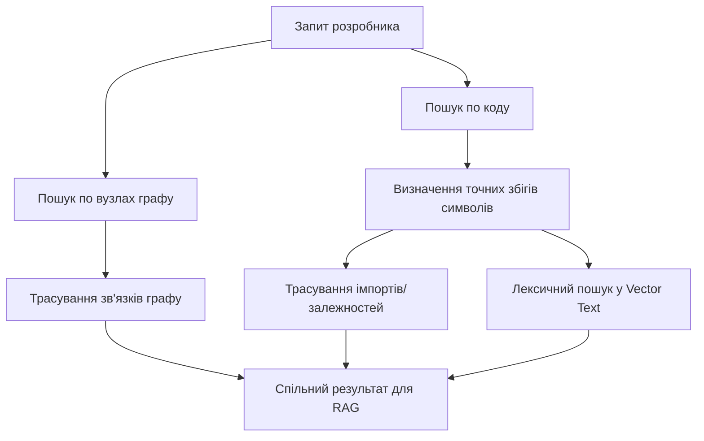

# Розділ 6: Пошук, Індексація та RAG

Memory OS містить вбудовану систему локальної індексації коду та пошуку знань. Вона дозволяє швидко знаходити зв'язки між правилами пам'яті та файлами коду без залучення важких зовнішніх векторних баз даних.

---

## 1. Побудова зрізу контексту (ContextRegistry)

Клас [ContextRegistry](src/memory_os/modules/context.py#L8) відповідає за періодичне сканування директорії проєкту та побудову файлу `agent_context/memory_snapshot.json`.

### 1.1. Ітерація та фільтрація файлів
Метод [iter_files](src/memory_os/modules/context.py#L52) обходить файлове дерево проєкту.
* **Виключення директорій**: Системні папки, віртуальні середовища та бінарні кеші (`.git`, `.venv`, `venv_auto`, `node_modules`, `__pycache__`, `data`, `.gemini`, `.cursor` тощо) повністю ігноруються.
* **Обмеження за типами**: Скануються лише текстові файли з розширеннями `.md`, `.txt`, `.py`, `.js`, `.css`, `.html`, `.sql`, `.json`, `.yaml`, `.toml`.
* **Обмеження розміру**: Файли, що перевищують ліміт розміру (за замовчуванням 220 KB), автоматично ігноруються для запобігання перевантаженню оперативної пам'яті.

### 1.2. Редагування секретів (Secrets Redaction)
Для захисту приватних даних перед індексуванням вміст файлу проходить крізь метод [redact](src/memory_os/modules/context.py#L22). За допомогою регулярних виразів вирізаються:
* API ключі OpenAI/Gemini/OpenRouter (наприклад, `sk-` токени).
* Пари паролів та токенів у конфігах (патерни `api_key`, `token`, `secret`, `password`).
* Локальні або віддалені рядки підключення до баз даних (патерни `postgresql://`).
Всі виявлені секрети замінюються на рядок `[REDACTED]`.

### 1.3. Вилучення символів коду (AST & Regex)
Для розуміння структури коду `ContextRegistry` аналізує вміст файлів:

#### Python Файли (абстрактне синтаксичне дерево):
За допомогою вбудованої бібліотеки `ast` метод [python_symbols](src/memory_os/modules/context.py#L80) вилучає:
* Назви класів із вказівкою номера рядка (наприклад, `LifecycleManager:14`).
* Назви функцій та асинхронних методів (`propose:45`).
* Залежності першого рівня (імпортовані бібліотеки та локальні модулі).

#### JavaScript Файли:
Через регулярні вирази метод [js_symbols](src/memory_os/modules/context.py#L105) шукає конструкції `export function`, `class` та оператори `import`.

#### Роутинг (Flask / Blueprints):
За допомогою регулярних виразів у Python файлах виявляються шляхи API-ендпоінтів (наприклад, `@admin_bp.route('/metrics')`).

#### Markdown Файли:
Метод вилучає ієрархію заголовків (`#`, `##`, `###`), формуючи карту розділів документа.

### 1.4. Побудова вектора представлення (Vector Text)
Для кожного файлу створюється коротке текстове представлення `vector_text`:
`vector_text = <ШляхДоФайлу> + <СписокКласів> + <СписокФункцій> + <Заголовки> + <Перші360СимволівВмісту>`
Цей рядок разом із метаданими (SHA-256, розмір) зберігається в масиві зрізу.

---

## 2. Механізм пошуку та RAG (MemorySearcher)

Клас [MemorySearcher](src/memory_os/modules/search.py#L9) виконує двонаправлений пошук за один запит:

### 2.1. Пошук по вузлах пам'яті та трасування графу
1. Система шукає ключові слова у полях `id`, `summary`, `type` та масиві `evidence` вузлів знань.
2. Для знайдених вузлів запускається метод [traverse_graph](src/memory_os/modules/search.py#L36). Він рекурсивно на вказану глибину (`depth`) обходить пов'язані вузли, аналізуючи як поле `related_nodes` самих вузлів, так і ребра зв'язку з `edges.jsonl` (вхідні та вихідні зв'язки).

### 2.2. Пошук по файлах коду
1. **Точний збіг (Exact Symbol)**: Якщо запит збігається з назвою класу, функції чи назвою файлу.
2. **Трасування залежностей (Traverse Dependencies)**: Метод [traverse_dependencies](src/memory_os/modules/search.py#L65) аналізує імпорти точних збігів. Якщо файл **A** імпортує модуль **B**, і ми шукаємо файл **A**, модуль **B** автоматично підтягується в результати пошуку на глибину `depth`.
3. **Лексичний пошук (Lexical Search)**: Якщо точних збігів немає, виконується пошук підрядка всередині стислого представлення `vector_text`.

### 2.3. Ранжування результатів коду (Ranking)
Файли коду повертаються покупцеві у спеціальному форматі з присвоєнням рангу відповідності:
* **Rank 1 (`exact_symbol`)**: Прямий збіг імені файлу або символу (класу/методу).
* **Rank 2 (`code_dependency`)**: Суміжні файли, знайдені через дерево імпортів коду.
* **Rank 3 (`lexical`)**: Файли, знайдені за допомогою збігу ключових слів у текстовому описі чи прев'ю вмісту.

Цей структурований зріз (до 5 найкращих результатів) автоматично записується у файл `agent_context/active_memory.yaml` при виклику RAG CLI, надаючи агенту ідеально точний контекст для генерації коду.
